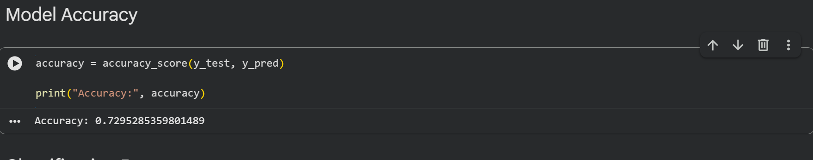
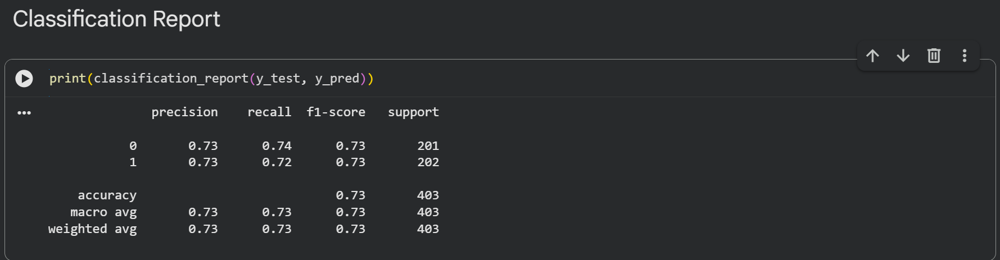
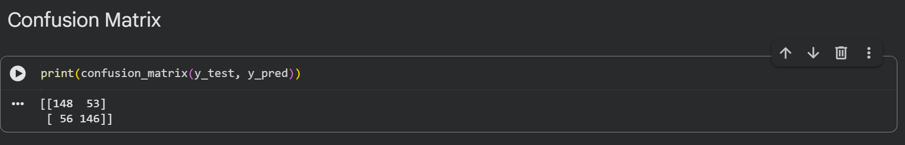

# PRODIGY_ML_03

## Task 03 - Cats vs Dogs Image Classification using HOG and SVM

### Objective

Develop a machine learning model to classify images of cats and dogs using Support Vector Machine (SVM).

### Dataset

Cats vs Dogs Dataset

### Technologies Used

* Python
* OpenCV
* NumPy
* Scikit-Learn
* HOG (Histogram of Oriented Gradients)
* Support Vector Machine (SVM)

### Project Workflow

1. Dataset Loading
2. Image Preprocessing
3. Grayscale Conversion
4. HOG Feature Extraction
5. Train-Test Split
6. SVM Model Training
7. Prediction and Evaluation

### Results

* Total Images Used: 2011
* Model: SVM (RBF Kernel)
* Accuracy Achieved: 72%

### Learning Outcomes

* Image Processing using OpenCV
* Feature Extraction using HOG
* Binary Image Classification
* Machine Learning Model Training
* Performance Evaluation

## Results

### Accuracy

### Classification Report

### Confusion Matrix

